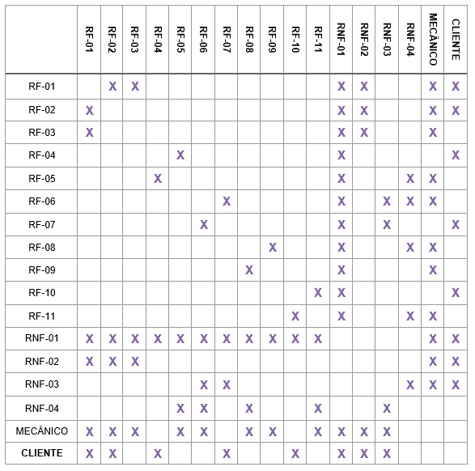

# Especificações do Projeto

Neste documento será abordada uma extensão da descrição do projeto de acordo com a visão do usuário, por meio de histórias de usuários, assim como o público alvo, por meio das personas. Também serão abordados os a parte da estrutura do negócio, sendo: requisitos funcionais, não funcionais, restrições do projeto, modelagem do processo de negócio, indicadores de desempenho, diagrama de casos de uso, matriz de rastreabilidade e gerenciamento de projeto.

## Personas

 Maria, 35 anos, trabalha como gerente de projetos em uma empresa de tecnologia, ela
 depende de seu carro para se deslocar diariamente para o trabalho. Ela é uma pessoa ocupada e ativa, que valoriza muito o seu tempo e quer garantir que o seu carro esteja sempre em perfeito estado de funcionamento.
Maria precisa encontrar tempo em sua agenda lotada para agendar as manutenções regulares e eventuais reparos em seu carro. Ela muitas vezes acaba deixando a manutenção para depois, o que pode resultar em problemas mecânicos inesperados e caros.

 Carlos, 50 anos, autônomo, dono de uma pequena empresa de transporte, ele depende de seus veículos para manter o negócio em funcionamento. Ele é um empresário ocupado e responsável, que está sempre procurando maneiras de melhorar a eficiência de sua empresa e reduzir os custos. Ele tem pouco conhecimento técnico em mecânica, mas sabe que manter seus veículos em boas condições é fundamental para o sucesso de sua empresa. Carlos precisa garantir que seus veículos estejam sempre em perfeitas condições de funcionamento para evitar atrasos, custos com reparos emergenciais e perda de negócios. Ele muitas vezes tem dificuldade em encontrar tempo para agendar as manutenções e reparos necessários, já que está sempre ocupado gerenciando sua empresa.

Flávio, 40 anos, é gerente de uma oficina de carros, como gestor está sempre buscando melhorar o sistema de atendimento ao cliente e também a eficiência dos trabalhos que são executados pelos mecânicos. Ele precisa melhorar o recebimento de pedidos de manutenção e também o tempo de resposta para os clientes que ficam constantemente ligando querendo uma resposta. Flávio gostaria de conhecer melhor os clientes podendo assim realizar um atendimento mais personalizado.

Sergio é proprietário de uma pequena oficina mecânica, ele também é responsável pela parte de gerenciamento entre clientes e a equipe de manutenção. Ele gostaria de digitalizar os processos da sua oficina, com isso ganhando agilidade e qualidade com seus clientes evitando perda de prazos ou datas de entregas, ele também vê a oportunidade de melhorar a comunicação com seus clientes.

## Histórias de Usuários

Com base na análise das personas forma identificadas as seguintes histórias de usuários:

|EU COMO... `PERSONA`| QUERO/PRECISO ... `FUNCIONALIDADE` |PARA ... `MOTIVO/VALOR`                 |
|--------------------|------------------------------------|----------------------------------------|
|Usuário do sistema  | Registrar minhas tarefas           | Não esquecer de fazê-las               |
|Administrador       | Alterar permissões                 | Permitir que possam administrar contas |

Apresente aqui as histórias de usuário que são relevantes para o projeto de sua solução. As Histórias de Usuário consistem em uma ferramenta poderosa para a compreensão e elicitação dos requisitos funcionais e não funcionais da sua aplicação. Se possível, agrupe as histórias de usuário por contexto, para facilitar consultas recorrentes à essa parte do documento.

> **Links Úteis**:
> - [Histórias de usuários com exemplos e template](https://www.atlassian.com/br/agile/project-management/user-stories)
> - [Como escrever boas histórias de usuário (User Stories)](https://medium.com/vertice/como-escrever-boas-users-stories-hist%C3%B3rias-de-usu%C3%A1rios-b29c75043fac)
> - [User Stories: requisitos que humanos entendem](https://www.luiztools.com.br/post/user-stories-descricao-de-requisitos-que-humanos-entendem/)
> - [Histórias de Usuários: mais exemplos](https://www.reqview.com/doc/user-stories-example.html)
> - [9 Common User Story Mistakes](https://airfocus.com/blog/user-story-mistakes/)

## Modelagem do Processo de Negócio 

### Análise da Situação Atual

Apresente aqui os problemas existentes que viabilizam sua proposta. Apresente o modelo do sistema como ele funciona hoje. Caso sua proposta seja inovadora e não existam processos claramente definidos, apresente como as tarefas que o seu sistema pretende implementar são executadas atualmente, mesmo que não se utilize tecnologia computacional. 

### Descrição Geral da Proposta

Apresente aqui uma descrição da sua proposta abordando seus limites e suas ligações com as estratégias e objetivos do negócio. Apresente aqui as oportunidades de melhorias.

### Processo 1 – NOME DO PROCESSO

Apresente aqui o nome e as oportunidades de melhorias para o processo 1. Em seguida, apresente o modelo do processo 1, descrito no padrão BPMN. 

### Processo 2 – NOME DO PROCESSO

Apresente aqui o nome e as oportunidades de melhorias para o processo 2. Em seguida, apresente o modelo do processo 2, descrito no padrão BPMN.

## Indicadores de Desempenho

Apresente aqui os principais indicadores de desempenho e algumas metas para o processo. Atenção: as informações necessárias para gerar os indicadores devem estar contempladas no diagrama de classe. Colocar no mínimo 5 indicadores. 

Usar o seguinte modelo: 

Obs.: todas as informações para gerar os indicadores devem estar no diagrama de classe a ser apresentado a posteriori. 

## Requisitos

As tabelas que se seguem apresentam os requisitos funcionais e não funcionais que detalham o escopo do projeto. Para determinar a prioridade de requisitos, aplicar uma técnica de priorização de requisitos e detalhar como a técnica foi aplicada.

### Requisitos Funcionais

|ID    | Descrição do Requisito  | Prioridade |
|------|-----------------------------------------|----|
|RF-001| O sistema deve ter autenticação e controle de Acesso | ALTA |
|RF-002| O sistema deve permitir o controle de acesso baseado em perfis de usuário | Alta |
|RF-003| O sistema deve permitir o cadastro de mecânicos | Alta |
|RF-004| O sistema deve permitir agendar serviço | Alta |
|RF-005| O sistema deve permitir que os mecânicos visualizem os agendamentos | Alta |
|RF-006| O sistema deve permitir que os mecânicos atualizem o status dos serviços em andamento | Alta |
|RF-007| O sistema deve permitir que os clientes visualizem o status dos serviços agendados e recebam notificações sobre alterações no status. | Média |
|RF-008| O sistema deve permitir a venda de produtos pela aplicação. | Alta |
|RF-009| O sistema deve permitir que os mecânicos cadastrem os produtos disponíveis e os preços. | Alta |
|RF-010| O sistema deve permitir que os clientes adicionem produtos ao carrinho de compras, informem o endereço de entrega e realizem o pagamento pela aplicação. | Alta |
|RF-011| O sistema deve permitir que os mecânicos gerem relatórios de vendas, agendamentos e serviços concluídos. | Média |

### Requisitos não Funcionais

|ID     | Descrição do Requisito  |Prioridade |
|-------|-------------------------|----|
|RNF-001| O sistema deve ser fácil de usar e intuitivo para os usuários | Média |
|RNF-002| O sistema deve garantir a privacidade das informações dos usuários e a proteção contra ataques externos |  Alta |
|RNF-003| O sistema deve garantir um tempo de resposta rápido para as ações do usuário | Média |
|RNF-004| O sistema deve ser conter a sua versão web e mobile | Alta |

Com base nas Histórias de Usuário, enumere os requisitos da sua solução. Classifique esses requisitos em dois grupos:

- [Requisitos Funcionais
 (RF)](https://pt.wikipedia.org/wiki/Requisito_funcional):
 correspondem a uma funcionalidade que deve estar presente na
  plataforma (ex: cadastro de usuário).
- [Requisitos Não Funcionais
  (RNF)](https://pt.wikipedia.org/wiki/Requisito_n%C3%A3o_funcional):
  correspondem a uma característica técnica, seja de usabilidade,
  desempenho, confiabilidade, segurança ou outro (ex: suporte a
  dispositivos iOS e Android).
Lembre-se que cada requisito deve corresponder à uma e somente uma
característica alvo da sua solução. Além disso, certifique-se de que
todos os aspectos capturados nas Histórias de Usuário foram cobertos.

## Restrições

O projeto está restrito pelos itens apresentados na tabela a seguir.

|ID| Restrição                                             |
|--|-------------------------------------------------------|
|01| O projeto deverá ser entregue até o final do semestre |
|02| Não pode ser desenvolvido um módulo de backend        |

Enumere as restrições à sua solução. Lembre-se de que as restrições geralmente limitam a solução candidata.

> **Links Úteis**:
> - [O que são Requisitos Funcionais e Requisitos Não Funcionais?](https://codificar.com.br/requisitos-funcionais-nao-funcionais/)
> - [O que são requisitos funcionais e requisitos não funcionais?](https://analisederequisitos.com.br/requisitos-funcionais-e-requisitos-nao-funcionais-o-que-sao/)

## Diagrama de Casos de Uso

O diagrama de casos de uso é o próximo passo após a elicitação de requisitos, que utiliza um modelo gráfico e uma tabela com as descrições sucintas dos casos de uso e dos atores. Ele contempla a fronteira do sistema e o detalhamento dos requisitos funcionais com a indicação dos atores, casos de uso e seus relacionamentos. 

As referências abaixo irão auxiliá-lo na geração do artefato “Diagrama de Casos de Uso”.

> **Links Úteis**:
> - [Criando Casos de Uso](https://www.ibm.com/docs/pt-br/elm/6.0?topic=requirements-creating-use-cases)
> - [Como Criar Diagrama de Caso de Uso: Tutorial Passo a Passo](https://gitmind.com/pt/fazer-diagrama-de-caso-uso.html/)
> - [Lucidchart](https://www.lucidchart.com/)
> - [Astah](https://astah.net/)
> - [Diagrams](https://app.diagrams.net/)

# Matriz de Rastreabilidade

A matriz de rastreabilidade é uma ferramenta usada para facilitar a visualização dos relacionamento entre requisitos e outros artefatos ou objetos, permitindo a rastreabilidade entre os requisitos e os objetivos de negócio. 

# Gerenciamento de Projeto

De acordo com o PMBoK v6 as dez áreas que constituem os pilares para gerenciar projetos, e que caracterizam a multidisciplinaridade envolvida, são: Integração, Escopo, Cronograma (Tempo), Custos, Qualidade, Recursos, Comunicações, Riscos, Aquisições, Partes Interessadas. Para desenvolver projetos um profissional deve se preocupar em gerenciar todas essas dez áreas. Elas se complementam e se relacionam, de tal forma que não se deve apenas examinar uma área de forma estanque. É preciso considerar, por exemplo, que as áreas de Escopo, Cronograma e Custos estão muito relacionadas. Assim, se eu amplio o escopo de um projeto eu posso afetar seu cronograma e seus custos.

## Gerenciamento de Tempo

O gráfico de Gantt ou diagrama de Gantt também é uma ferramenta visual utilizada para controlar e gerenciar o cronograma de atividades de um projeto. Com ele, é possível listar tudo que precisa ser feito para colocar o projeto em prática, dividir em atividades e estimar o tempo necessário para executá-las.

## Gerenciamento de Equipe

O gerenciamento adequado de tarefas contribuirá para que o projeto alcance altos níveis de produtividade. Por isso, é fundamental que ocorra a gestão de tarefas e de pessoas, de modo que os times envolvidos no projeto possam ser facilmente gerenciados. 

## Gestão de Orçamento

O processo de determinar o orçamento do projeto é uma tarefa que depende, além dos produtos (saídas) dos processos anteriores do gerenciamento de custos, também de produtos oferecidos por outros processos de gerenciamento, como o escopo e o tempo.

•	Cálculos realizados considerando 1000 horas de desenvolvimento.  
•	Cálculos realizados para o primeiro ano de produção, tendo em vista que os valores mensais e anuais de servidores e App Stores continuarão a serem cobrados.

